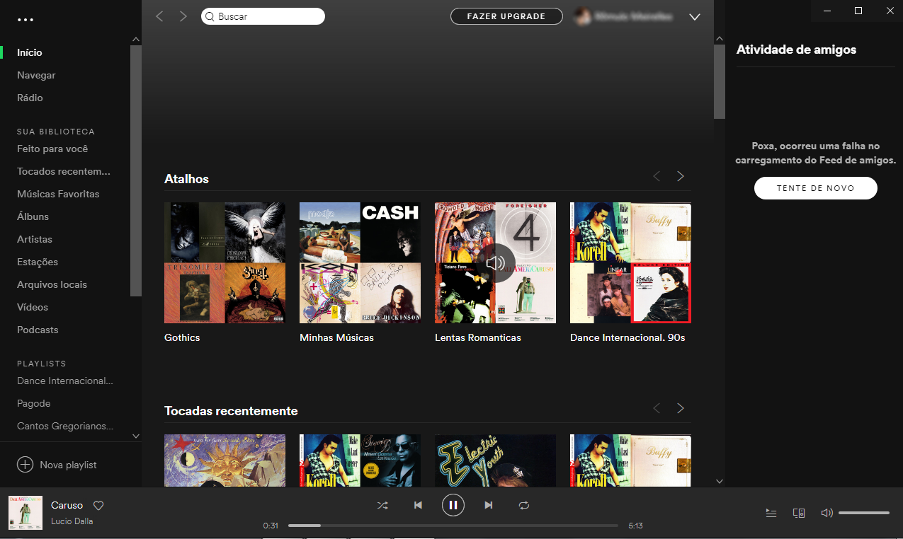

#  Spotify Loader. (Retire as propagandas (ADS) de seu APP Desktop.) Escute sem Interrupções.
  
Blocks advertisements on spotify desktop 
Bloqueie propagandas da google e outros no spotify para desktop, escute suas musicas sem interrupções, baixe ou compile nosso loader e utilize na versão 1.0.96.181 do Spotify para não haver problemas no Loader. 

## Tutorial: 
Baixe e instale o spotify desktop versão 1.0.96.181  
e de 2 cliques no loader pois ele irá configurar e abrir o spotify original sem propagandas. 
Spotify v1.0.96.181: https://mega.nz/file/8AwH3CpD#ruCMuCmnKUqISyiNrbkdPWe_t715RvFg0GTK1WtTVeY 

## ✨ Características ✨

- Loader Spotify
- Download de Lista de Host de advertisements.
- Modificação do arquivo ETC/HOST do Windows.
- Implementação da Lista no aquivo ETC/HOST.
- Não modifica nemhuma configuração anterior feita pelo usuário ou sistema.
- Apos fechar o Spotify restaura o HOST anterior.
- Não Modifica o Spotify.
 

